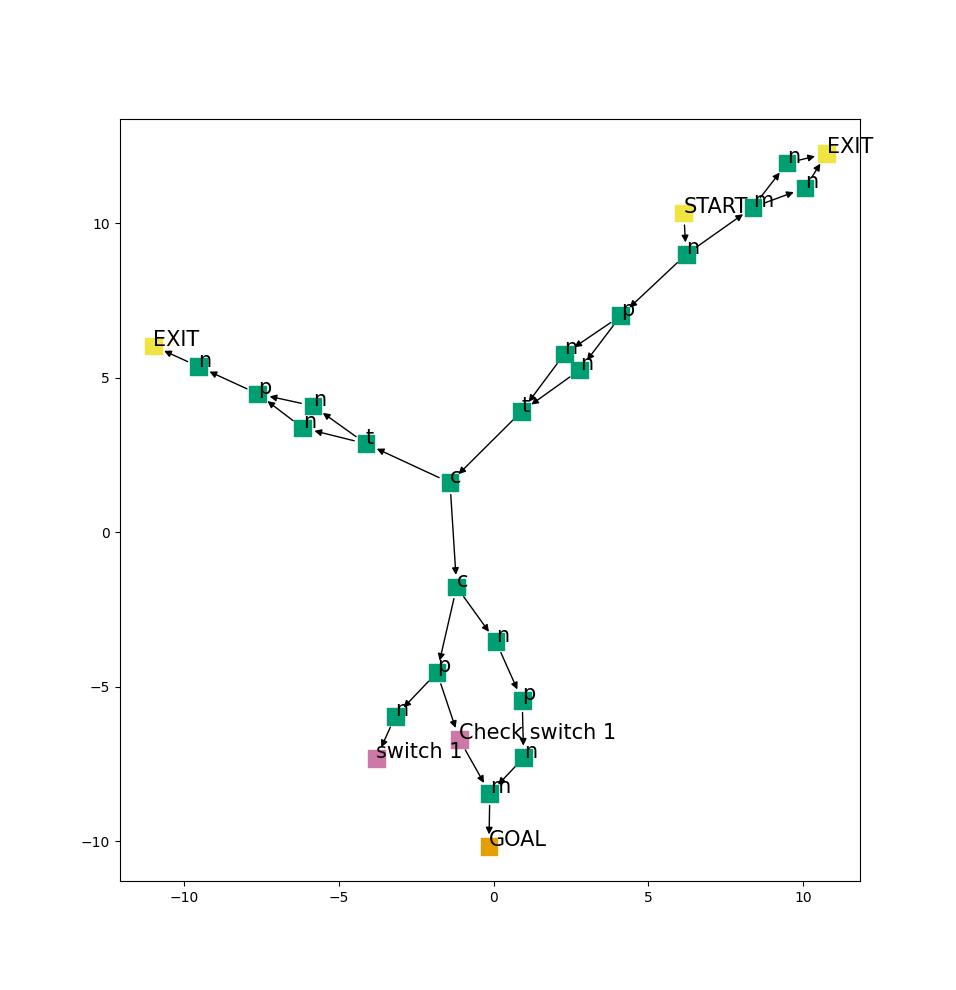

# Dungeon Generator

**version:** 1.0

**date:** 2021-12-02

based on the grammar defined by [fantomx11](https://forum.rpg.net/index.php?members/fantomx11.74669/) in the [RPG.net forum](https://forum.rpg.net/index.php?threads/necro-my-zelda-dungeon-generator.827119/)

## Install

Use [Python Poetry](https://python-poetry.org/docs/) for creating the virtual environment with

```bash
$ poetry install
```

## Usage

Launch the CLI script

```bash
$ poetry run python dungeon_generator_cli.py
```

```bash
usage: dungeon_generator_cli.py [-h] [--post24] [--post30] [--seed SEED] [--debug]

optional arguments:
  -h, --help   show this help message and exit
  --post24     Generate a Dungeon using the Post24 Grammar
  --post30     Generate a Dungeon using the Post30 Grammar
  --seed SEED  Seed for the dungeon
  --debug      Debug information
```

### Examples

Running the command

```bash
$ poetry run python dungeon_generator_cli.py --post30 --seed 15143
```

will result in something similar to this graph



### Legend

#### Post24

**GOAL:** Dungeon Goal

**START:** Initial position

**e:** Enemy

**eb:** Main Boss

**em:** Mini Boss

**external:** Object from outside the Dungeon

**n:** Nothing/Explore

**p:** Puzzle

**sw:** Switch (Lever, etc)

#### Post30

**EXIT:** Another Entrance/Exit

**GOAL:** Dungeon Goal

**START:** Initial position

**c:** Challenge (Skill check)

**gb:** Bonus goal

**m:** Monster

**n:** Nothing/Explore

**p:** Puzzle

**t:** Trap

## Relations

A simple analisis of the grammar elements relations can be found in the folder `relations`

### Usage

```bash
$ poetry run python relations/rel24.py
```
